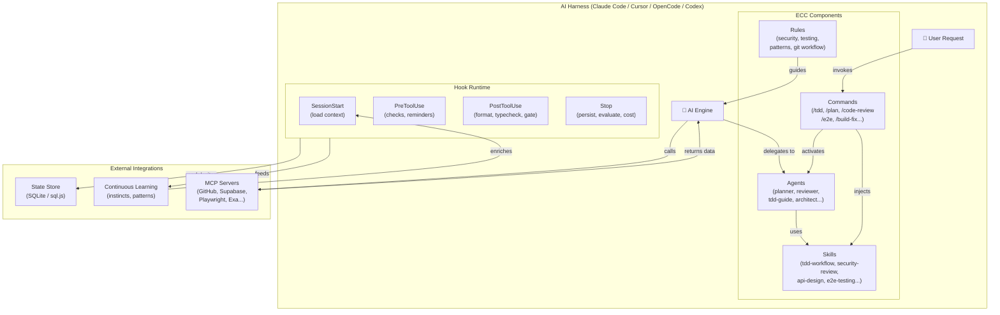

# System Architecture — Everything Claude Code (ECC)

## Overview

Everything Claude Code (ECC) is an **agent harness performance system** — a layered, modular framework that augments AI coding assistants (Claude Code, Cursor, OpenCode, Codex) with specialized sub-agents, domain skills, lifecycle hooks, and opinionated rules. Its architectural style is **plugin-based agent orchestration** with event-driven automation.

---

## System Components

### 1. Agent Layer (`agents/`)

Specialized sub-agents implemented as Markdown files with YAML frontmatter. Each agent has:
- A `name` (how it is referenced)
- A `description` (governs when it is auto-invoked)
- A `tools` list (what capabilities it may use)
- A `model` preference (`opus`, `sonnet`, `haiku`)
- A detailed system prompt defining its behavior

Agents operate in isolation — they read context, produce output, and do not maintain state between invocations.

### 2. Skill Layer (`skills/`)

Reusable knowledge modules encoded as Markdown files (`SKILL.md`). Skills provide:
- Domain knowledge (e.g., `tdd-workflow`, `security-review`, `api-design`)
- Workflow patterns (e.g., `e2e-testing`, `verification-loop`)
- Technology guides (e.g., `kotlin-patterns`, `django-tdd`, `swift-concurrency-6-2`)

Skills are **injected into context** when invoked (via slash commands or automatic activation). They do not execute code themselves — they inform the AI's behavior.

### 3. Hook Layer (`hooks/hooks.json`, `scripts/hooks/`)

Lifecycle automation system. Hooks are registered for Claude Code lifecycle events and execute Node.js scripts or shell commands:

| Hook Event | Purpose |
|---|---|
| `SessionStart` | Load previous session context, detect package manager |
| `PreToolUse` | Security checks, compact suggestions, dev server reminders |
| `PostToolUse` | Auto-format, TypeScript check, quality gates, learning capture |
| `PreCompact` | Save state before context is compacted |
| `Stop` | Persist session, evaluate patterns, track costs |
| `SessionEnd` | Final session lifecycle marker |

### 4. Command Layer (`commands/`)

Slash commands that users invoke explicitly (e.g., `/tdd`, `/plan`, `/code-review`). Each command is a Markdown file with a `description` frontmatter field. Commands typically:
- Invoke a specific agent
- Activate a skill workflow
- Run a script

### 5. Rules Layer (`rules/`)

Always-follow guidelines injected into Claude Code's system context. Organized by:
- `common/` — Cross-language rules: security, testing, patterns, agents, git workflow
- Language-specific directories: `typescript/`, `python/`, `golang/`, `kotlin/`, `swift/`, `php/`, `perl/`

Rules are passive — they shape AI behavior without triggering execution.

### 6. MCP Layer (`mcp-configs/mcp-servers.json`)

Configuration for 20+ Model Context Protocol (MCP) servers that extend Claude Code's capabilities:
- `github` — GitHub PRs, issues, repos
- `supabase` — Database operations
- `firecrawl` — Web scraping
- `playwright` — Browser automation
- `memory` — Persistent memory across sessions
- `sequential-thinking` — Chain-of-thought reasoning
- `exa-web-search` — Neural web search
- `insaits` — AI-to-AI security monitoring
- `fal-ai` — Image/video/audio generation
- And 12+ more

### 7. Script Layer (`scripts/`)

Cross-platform Node.js utilities for:
- **Install system**: `install-plan.js`, `install-apply.js` — resolve and apply component installs
- **CLI**: `ecc.js` — primary `npx ecc` entry point
- **Session management**: `session-manager.js`, `sessions-cli.js`, `session-inspect.js`
- **Orchestration**: `orchestrate-worktrees.js`, `orchestration-status.js`
- **Hook scripts**: `scripts/hooks/` — individual hook implementations
- **CI validators**: `scripts/ci/` — validate agents, commands, rules, skills, hooks

### 8. State Store (`scripts/lib/state-store/`)

SQLite-based persistence layer using `sql.js`. Stores:
- Session summaries and metadata
- Skill invocation patterns
- Cost and token metrics
- Instinct/pattern data for continuous learning

### 9. Continuous Learning System (`skills/continuous-learning-v2/`)

An observer-pattern system that:
1. Captures tool use observations via hooks (async, non-blocking)
2. Evaluates sessions for extractable patterns (`evaluate-session.js`)
3. Stores patterns as "instincts" in the state store
4. Makes instincts available at `SessionStart` for context enrichment

---

## Service Boundaries

```
┌─────────────────────────────────────────────────────────────────┐
│                    AI Harness (Claude Code)                      │
│  ┌──────────┐  ┌──────────┐  ┌──────────┐  ┌────────────────┐  │
│  │ Agents   │  │ Skills   │  │ Commands │  │    Rules       │  │
│  │ (opus/   │  │ (context │  │ (slash   │  │ (always-follow │  │
│  │  sonnet) │  │  inject) │  │  cmds)   │  │  guidelines)   │  │
│  └──────────┘  └──────────┘  └──────────┘  └────────────────┘  │
│                                                                   │
│  ┌─────────────────────────────────────────────────────────────┐ │
│  │              Hook Runtime (event-driven)                    │ │
│  │  SessionStart → PreToolUse → PostToolUse → Stop → SessionEnd│ │
│  └─────────────────────────────────────────────────────────────┘ │
└─────────────────────────────────────────────────────────────────┘
          │                                     │
          ▼                                     ▼
  ┌──────────────┐                    ┌──────────────────┐
  │  State Store │                    │   MCP Servers    │
  │  (SQLite/    │                    │  (GitHub, DB,    │
  │   sql.js)    │                    │   Web, Browser)  │
  └──────────────┘                    └──────────────────┘
```

---

## Interaction Between Modules

- **Commands → Agents**: A slash command (e.g., `/tdd`) activates the `tdd-guide` agent
- **Commands → Skills**: A command may inject a skill into context (e.g., `/code-review` activates `security-review` skill)
- **Hooks → Scripts**: Hook events (SessionStart, etc.) invoke Node.js scripts in `scripts/hooks/`
- **Scripts → State Store**: Hook scripts read/write session data via `state-store/index.js`
- **Hooks → Continuous Learning**: Observation hooks feed data into `skill-evolution` and `skill-improvement` systems
- **Rules → AI Context**: Rules are loaded at session start and govern all AI responses
- **MCP → Claude Code**: MCP servers extend Claude Code with external tool capabilities

---

## Architectural Style

ECC follows a **plugin-based, event-driven, agent-orchestration** architecture:

1. **Plugin-based**: ECC is installed as a Claude Code plugin; its components (agents, skills, hooks, rules) are injected into an existing AI harness rather than running standalone
2. **Event-driven**: Lifecycle hooks trigger automation at specific points in the AI session lifecycle
3. **Agent-orchestration**: The main AI can delegate to specialized sub-agents, each with a focused role and appropriate model tier
4. **Modular**: Each component (agent, skill, hook, command, rule) is independently defined and testable
5. **Layered**: Rules → Skills → Agents → Commands form a progressively more specific layer of behavior

---

## Mermaid System Architecture Diagram



---

## Cross-Harness Architecture

ECC targets four harnesses through separate configuration trees:

| Harness | Config Location | Format |
|---|---|---|
| Claude Code | `hooks/`, `agents/`, `commands/`, `rules/` | Markdown + JSON |
| Cursor IDE | `.cursor/hooks/`, `.cursor/rules/`, `.cursor/skills/` | JS hooks + Markdown |
| OpenCode | `.opencode/commands/`, `.opencode/prompts/`, `.opencode/tools/` | Markdown + TypeScript |
| Codex (OpenAI) | `.codex/agents/`, `AGENTS.md` | TOML + Markdown |

The same conceptual agent/skill/hook exists in multiple formats to achieve cross-harness parity.
