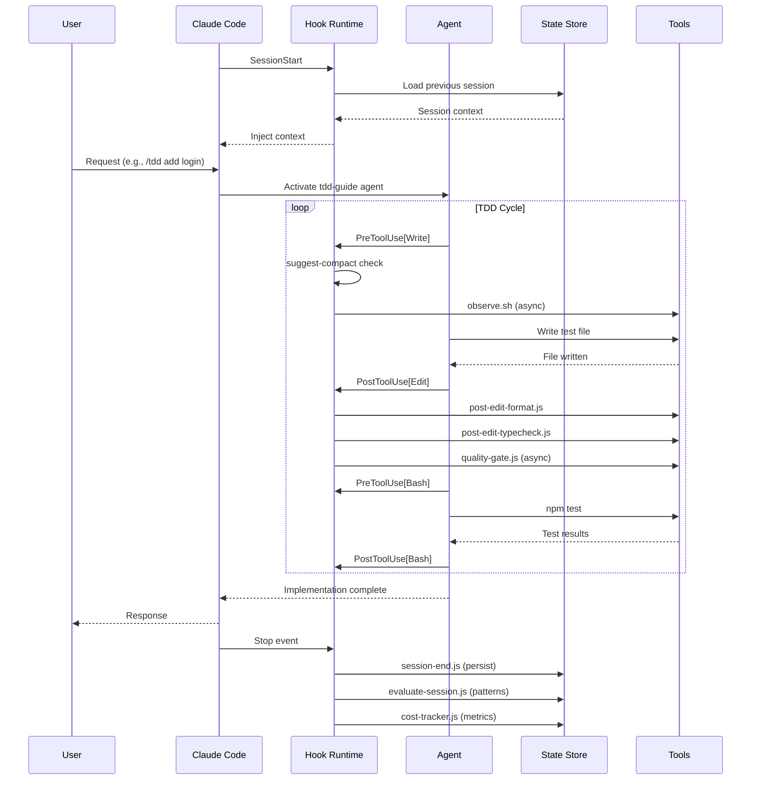

# Request Lifecycle — Everything Claude Code

## Overview

This document traces the complete lifecycle of a user request through the ECC system — from initial input to final response — including all hook invocations, agent activations, skill injections, and state persistence steps.

---

## High-Level Request Lifecycle

```
Session Start
  ↓ [SessionStart hook: load context]
User Types Request
  ↓ [AI reads request + ECC rules + loaded context]
Request Routing
  ↓ [Slash command or auto-agent match]
Agent Activation (if needed)
  ↓ [Agent reads codebase, produces plan/review/implementation]
Tool Use (Bash / Edit / Write / Read)
  ↓ [PreToolUse hooks fire]
  → [Tool executes]
  ↓ [PostToolUse hooks fire]
AI Produces Response
  ↓ [Stop hooks fire: persist session, evaluate patterns, track costs]
User Reads Response
```

---

## Phase 1: Session Initialization

When a Claude Code session starts, the `SessionStart` hook fires:

1. **Load last session state** — reads from SQLite state store (`~/.claude/sessions.db`)
2. **Inject git context** — runs `git status --short` to show recent changes
3. **Detect package manager** — checks `package.json`, `yarn.lock`, `pnpm-lock.yaml`, `bun.lockb`
4. **Load instincts** — retrieves patterns extracted from previous sessions
5. **Format context block** — produces a summary injected into the context window

**Context block example:**
```
[ECC Session Context]
Last session: 2026-03-15 14:32 — Implemented user authentication with JWT
Recent git changes: M src/auth/middleware.ts, A src/auth/jwt.ts
Package manager: pnpm
Active instincts: 3 patterns loaded (type-safe-api, tdd-first, error-boundary)
```

---

## Phase 2: Request Analysis

The AI processes the user request against:
- **ECC rules** (always-follow guidelines from `rules/common/` and language-specific rules)
- **Session context** (loaded by SessionStart hook)
- **Loaded skills** (injected by previous commands or session start)

The AI determines:
1. Does this request match a slash command? → Route to command
2. Does this request match an agent's description? → Activate agent
3. Is this a simple task? → Handle directly

---

## Phase 3: Slash Command Routing

If the user types a slash command:

| Command | Activates | Flow |
|---|---|---|
| `/tdd` | `tdd-guide` agent | Scaffold → Tests → Implement → Refactor → Coverage |
| `/plan` | `planner` agent | Analyze → Plan → Phase → Risk assess |
| `/code-review` | `code-reviewer` agent | Git diff → Review checklist → Report |
| `/security` | `security-reviewer` agent | Scan → Audit → Report |
| `/e2e` | `e2e-runner` agent | Generate Playwright tests → Execute |
| `/build-fix` | `build-error-resolver` agent | Diagnose → Fix → Verify |
| `/refactor-clean` | `refactor-cleaner` agent | Find dead code → Clean → Verify |
| `/update-docs` | `doc-updater` agent | Check docs → Update → Verify |
| `/learn` | Skill evolution system | Analyze session → Extract patterns → Store |
| `/verify` | Verification workflow | Lint → Test → Build → Coverage check |

---

## Phase 4: Agent Execution

When an agent is activated, it follows its system prompt:

### Example: TDD Workflow

```
tdd-guide activated
  → 1. Read existing code structure (Read/Grep tools)
  → 2. Scaffold interfaces/types
  → 3. Write failing tests (Write tool)
  → 4. Run tests via Bash ("npm test") — PreToolUse[Bash] hook fires
  → 5. Write minimal implementation (Edit tool) — PostToolUse[Edit] hooks fire:
       - post-edit-format.js: auto-format
       - post-edit-typecheck.js: TypeScript check
       - post-edit-console-warn.js: console.log check
       - quality-gate.js: async quality checks
  → 6. Run tests again (Bash) — verify passing
  → 7. Refactor (Edit) — PostToolUse hooks fire again
  → 8. Run coverage check (Bash) — verify 80%+
  → 9. Report results
```

### Example: Planning Workflow

```
planner activated
  → 1. Read codebase structure (Read/Grep/Glob)
  → 2. Analyze existing patterns
  → 3. Generate phased implementation plan (no tools — pure output)
  → 4. Report plan in structured Markdown format
```

---

## Phase 5: Tool Use Cycle

Every time the AI uses a tool (Bash, Edit, Write, Read, etc.):

### PreToolUse Sequence
```
Tool use requested
  → run-with-flags.js checks profile and disabled list
  → auto-tmux-dev.js: check if dev server should start
  → suggest-compact.js: check if compaction should be suggested
  → observe.sh (async): capture observation for learning
  → [Tool executes]
```

### PostToolUse Sequence (Edit/Write)
```
Edit/Write completed
  → post-edit-format.js: auto-format JS/TS
  → post-edit-typecheck.js: TypeScript check
  → post-edit-console-warn.js: console.log scan
  → quality-gate.js (async): run full quality checks
  → observe.sh (async): capture result for learning
```

---

## Phase 6: Response Generation

After all tool uses complete, the AI generates its response. Then the **Stop** event fires:

```
AI response complete
  → Stop hooks fire:
    → check-console-log.js: scan modified files
    → session-end.js (async): persist session to state store
    → evaluate-session.js (async): extract patterns if worthy
    → cost-tracker.js (async): record token/cost metrics
```

The Stop hooks run **after** the response is visible to the user — they are non-blocking from the user's perspective.

---

## Phase 7: Session Persistence

The `session-end.js` hook writes to the SQLite state store:

```
State Store Update
  → session_id: unique identifier
  → timestamp: current time
  → transcript_summary: compressed session summary
  → git_changes: list of modified files
  → cost_usd: total session cost
  → token_count: total tokens used
  → patterns_extracted: count of new instincts
```

This data is read by the next session's `SessionStart` hook to provide continuity.

---

## Sequence Diagram



---

## Context Window Management

ECC manages context window pressure through:

1. **SessionStart compaction** — only injects a summary, not full history
2. **suggest-compact hook** — monitors edit/write frequency and suggests `/checkpoint`
3. **PreCompact hook** — saves state before Claude Code's automatic compaction
4. **strategic-compact skill** — teaches optimal compaction timing
5. **`/checkpoint` command** — manual context save + compact

Context budget recommendation from ECC: stay below 80% context utilization to avoid performance degradation from automatic compaction.

---

## Error Recovery Paths

| Error Condition | Recovery Path |
|---|---|
| Build fails | `build-error-resolver` agent activated automatically |
| Tests fail | `tdd-guide` reviews failure and proposes fixes |
| TypeScript errors | `post-edit-typecheck.js` hook reports errors inline |
| Security issue found | `security-reviewer` agent activated, response blocked if CRITICAL |
| Loop stalls | `loop-operator` agent detects stall, intervenes |
| Context exhausted | `session-end.js` saves state, session can be resumed via `/resume-session` |
