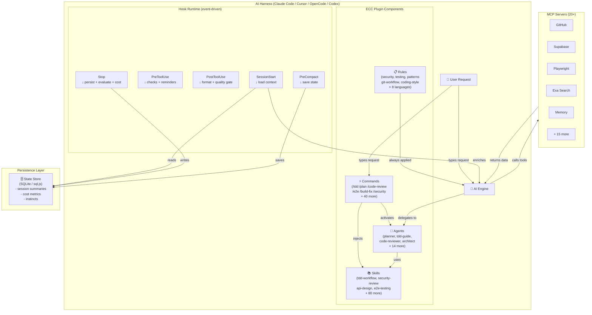
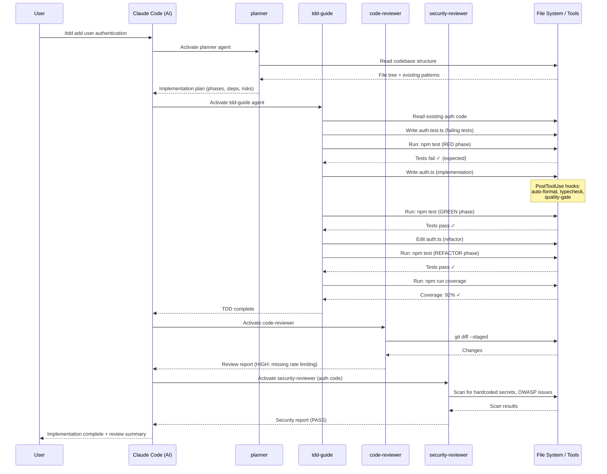
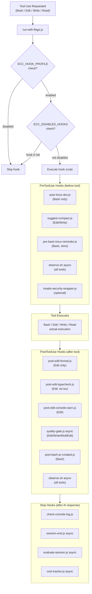
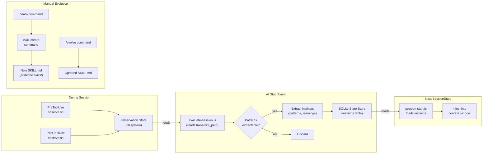
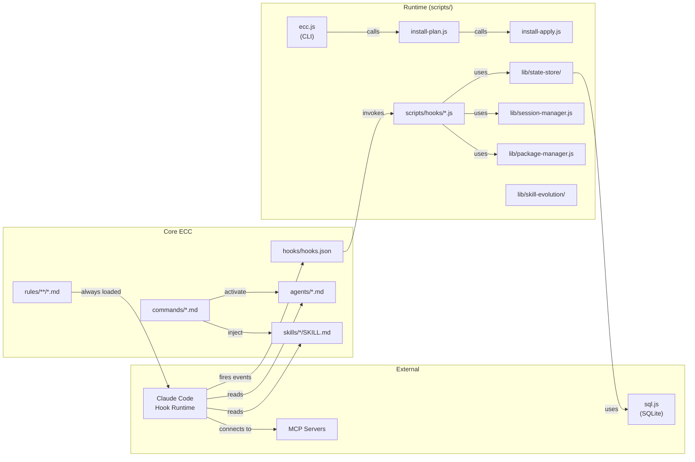
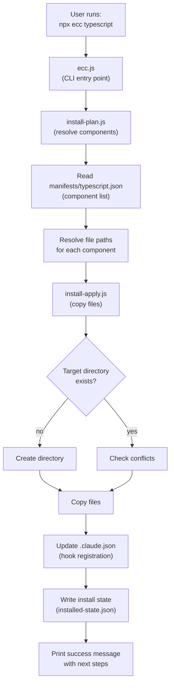
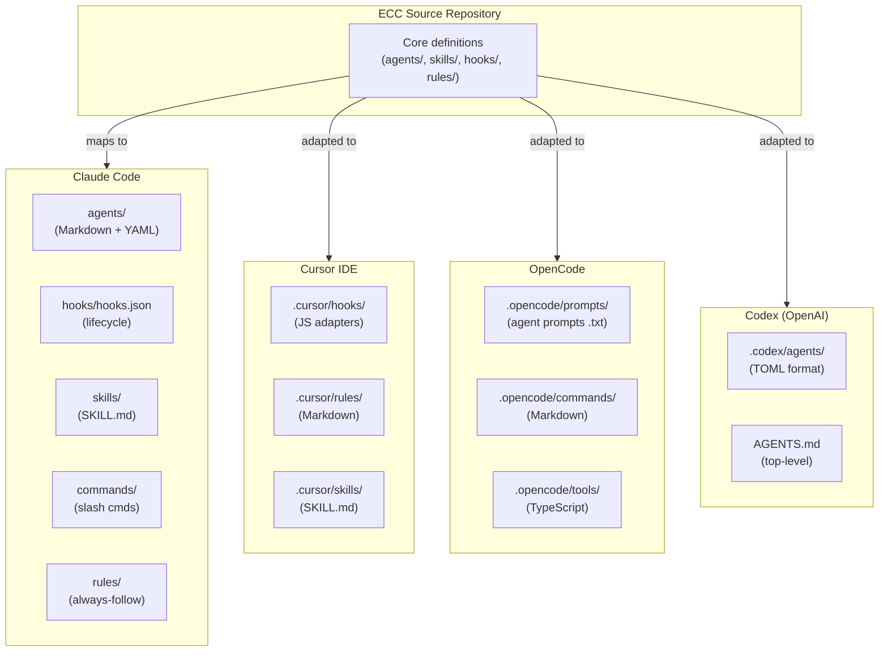

# ECC Diagrams

This directory contains Mermaid diagrams for all major aspects of the Everything Claude Code system.

All diagrams use Mermaid syntax and render natively in GitHub Markdown.

---

## 1. System Architecture

---

## 2. Agent Interaction Sequence (TDD Workflow)

---

## 3. Hook Execution Pipeline

---

## 4. Continuous Learning Pipeline

---

## 5. Component Dependency Graph

---

## 6. Install System Flow

---

## 7. Cross-Harness Architecture

